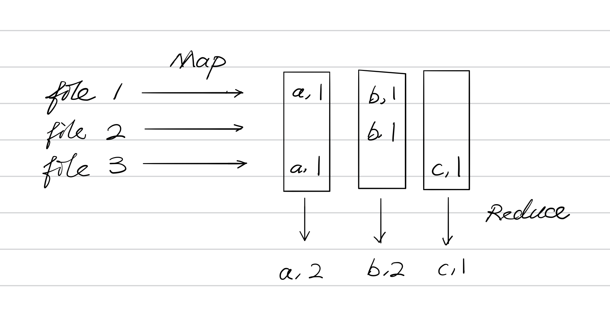

### 1. Introduction

- 起因
  - Parallelism
  - Fault tolerance
  - Physically separated
  - Security / isolated
- challenges
  - Concurrency
  - Partial failure
  - Performance 
- Schedule
  - lectures
  - papers
  - 2 exams
  - labs
    1. MapReduce
    2. Raft
    3. K/V server
    4. Sharded K/V service
  - project
- 从架构到应用
  - Infrastructure
    - Storage
      - 相关研究最成熟
    - Communications
      - 本节课主要是使用，而不是研究
    - Computation
      - MapReduce
    - 我们想要构建一层 Abstraction 来掩盖底层的分布式细节
  - Implementation
    - Remote procedure call (RPC)
    - Threads 
    - Concurrency control
- 主题
  - Performance
    - Scalability
      - Scalable speed-up
      - 运算速度随着运算资源线性增长，而不需要对系统进行任何更改
  - Fault tolerance
    - 标准
      - Availability 高可用
        - 在某些 failure 发生时，仍能提供正常服务
      - Recoverability 持久性
    - 工具
      - Non-volatile storage
      - Replication
  - Consistency
    - Strong
      - The cost for strong consistency is very expensive
    - Weak
      - 因此我们主要选择弱一致性，获得更高的效率

- MapReduce
  - 以 word count 为例分析
    - 
  - `Map(k, v)`
    - `k`: file name
    - `v`: content of the file
      - Split `v` into words, for each word `w`, `emit(w, 1)`
  - `Reduce(k, v)`
    - `emit(len(v))`
  - 说明
    - 把程序发送给文件对应的存储设备，而不是在网络上传输数据
    - 但是最终把按 row 存储（map 的输出）的中间结果转化为按 column 存储（reduce 的输入），还是需要传输一定数量的数据

